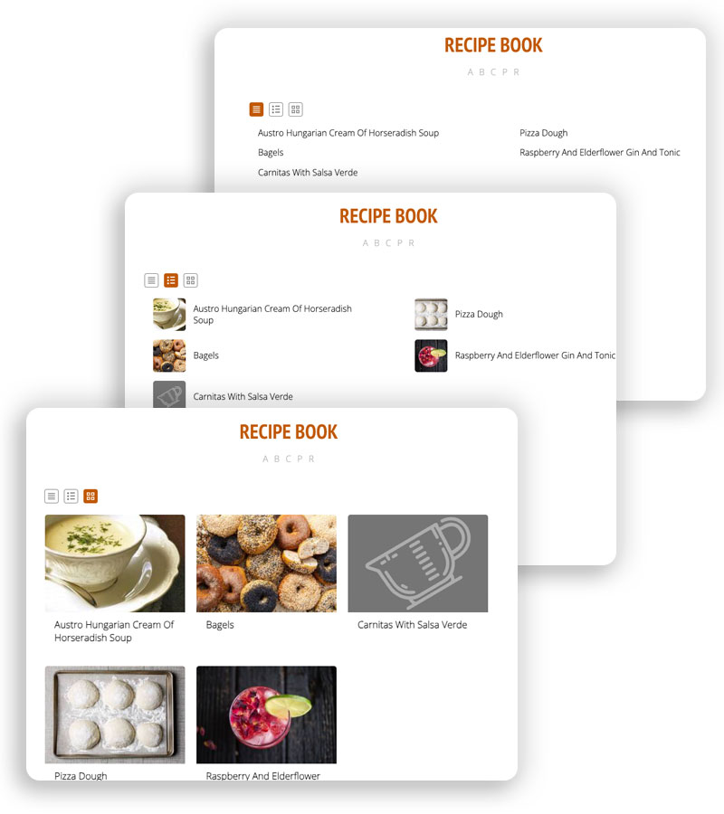
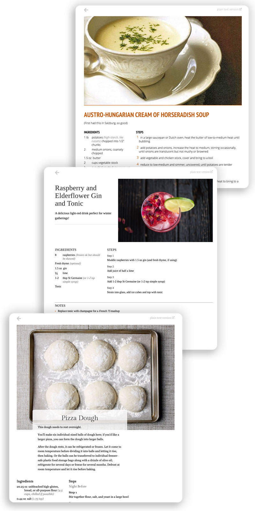
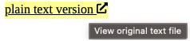

# NodeJS Recipe "Book" Publisher

This is based on Jeff Thompson's [recipes PHP project](https://github.com/jeffThompson/Recipes) without which I wouldn't have bothered (much of this document comes directly from his project). His summary still holds:

> *A super minimal recipe website – great for keeping track of family recipes, mods to ones you find online, or have created yourself!*

### Live Demo

[Live Recipe Book Demo](https://buzcarter.github.io/recipes-nodejs/)

This project generates static HTML. You may view locally just by dragging one of the output files into your browser, or load them onto your website, or zip up the output and share with a friend.

#### The "Recipe Book" Index



Choose your preferred view: "Compact List", "List with Thumbnail", or "Recipe Card Grid". (you may set the default view in `config.js`)


#### New: Per Recipe "Styles"



Choose your preferred recipe layout **per recipe**: clean, minimal default, Washington Post Recipe Layout ("washington-post"), or New York Times Cooking ("nytimes"). 

Just add a hidden comment somewhere in your recipe text (*tip*: near the top makes it easier to find and change)
 
```html
<!-- recipe-style: washington-post -->
```

A *style* tag (or comment) tells the app to swap the default styles for whichever one you specify. If you want _all_ of your recipes to render in a specific style just edit `config.js`, setting `defaultTheme` as desired.

```html
<!-- recipe-style: nytimes -->

# Gran's Killer Kowboy Kookies

```

Create your own... ummm, I owe y'all some documentation here, don't I? Soon... And should be consistent with "theme" v. "style". Sorry. Soon.

### Features:

* Recipes are written in plain text using the intuitive-ish [Markdown format](https://daringfireball.net/projects/markdown).
* Publishes an easy to read recipe index
    * use alphabetical index at page top;
    * filter (search) with partial matches (for example, filtering "ap pi" might filters out all but "Deep Dish Apple Pie")
    * pick how you want to view your recipes: compact (names only), names with thumbnails, or if you're more visual, choose "recipe cards" featuring large images.
* Template driven layout, customize or use the provided template
* Customize with themes -- color and minor layout settings. Plus, each recipe may choose its own theme.
* No more overlooked ingredients or skipped Steps as recipe pages allow you to flag your current step and mark-off those you've already done. In the Ingredients and Steps sections:
    * Tap an item once to highlight it, tappin again removes highlighting.
    * Double tab an item to mark as "completed" or "used" (the text will be italicized and have a strike-through through it). Double tapping again removes the line.
    * Navigate through Steps via arrow keys: when a Step is highlighted step using the left/right arrow keys highlights the previous/next step.
* Auto-generated links to a Google image search for that dish, recipes on Serious Eats and Google, and for restaurants on Yelp (in case you burn something and need takeout fast)
* Access to the original, plain text source for any recipe is but one click away



EXAMPLE: below a recipe with a few ingredients "ticked" off (indicating they've been used) and the current step being highlighted:


## MORE INFO

* [Installation](#installation)
* [Recipe format](#recipe-format)
* [Adding images](#adding-images)
* [Other options](#other-options)
* [Advanced customizations](#advanced-customizations)
* [Colophon & Thank Yous](#Colophon)

## Installation

This requires Node16 or later.

After cloning this repo or downloading the zip file from github simply install, add your recipes, and build:

```sh
npm install
```

Add your files to the `/recipes` directory, your images (optional) to `/images` and run:

```sh
npm run build
```

By default the converted HTML files will be in the `/output` directory. See the `config.js` file for options.

## RECIPE FORMAT  
In order to show up properly, your recipe's Markdown file should be named with dashes in place of spaces (ex: `rice-pilaf.md` or `saag-paneer.md`). This will be used to populate your list of recipes on the main page.

Use `recipe-template.md` and/or follow this format:

```markdown
# TITLE
Optional subheader

## info  
* About XXX minutes  
* XXX servings  

## ingredients
* 

## steps  
1. 

## notes  
* 

## based on  
* url to where the recipe came from
```

For example, below is the rendered recipe and its text source:


```markdown
# Raspberry and Elderflower Gin and Tonic
A delicious light-red drink perfect for winter gatherings!

## ingredients
* 8 raspberries (frozen ok but should be thawed)  
* Fresh thyme (optional)  
* Gin  
* 1/2 lime  
* 1-2 tbsp St Germaine (or 1-2 tsp simple syrup)  

## steps
1. Muddle raspberries with 1.5 oz gin (and fresh thyme, if using)  
2. Add juice of half a lime  
3. Add 1-2 tbsp St Germaine (or 1-2 tsp simple syrup)  
4. Strain into glass, add ice cubes and top with tonic 

## notes
* Replace tonic with champagne for a *French 75* mashup   

## based on
* https://www.instagram.com/p/Bq3ckR8HIDE/
```

You can optionally include info about how long the recipe takes and how many servings it makes. Put this before the `Ingredients` list:  

```markdown
## info  
* Takes about 90 minutes  
* Enough for a large biryani or a full-sized curry
```

The `Ingredients` and `Steps` sections can be split with subheaders too:

```markdown
## steps

## Prep the dal mixture:
1. Soak urad dal for 4 hours to overnight, drain  
2. Grind in blender until a smooth and thick paste (add a little water if necessary)  
3. Put in mixing bowl and whip with hands for 2-3 minutes until fluffy  
4. Add spices, herbs, and salt and whip again to combine  

### To fry:
1. Heat oil over medium/medium-high heat  
2. Take a bowl of water, wet hands, and form small balls  
3. Slide into oil and cook, flipping often, until golden  
4. Drain on paper towels  
```

### Alternative Section Names

You may already have a slew of text files you want to use, or you simply prefer to label your "Steps" section "Procedures" instead. Well, go ahead. There are several pre-defined synonyms. 

And don't worry about accidentally overwriting a section: sections are grouped according to thier synonymn (unrecognized section names will be listed during the build). Any unrecognized sections (based on name) will appear in the "Notes" section.

* "Based On", "Credits", "Resources", and "Source"
* "Notes", "Tips", "Variations", or "Nutrition Info"
* "Steps", "Directions", "Instructions", "Preparation", "procedures" (or "procedure")

### Final Rambling Tips

1. Every recipe should include only one "Title" (line begins with `#`)
2. Section names (see predefined names above) are marked with `##`
3. Under each section feel free to include sub-section names (lines beging wtih `###`)

## ADDING IMAGES  

Thanks to a suggestion from @mpember, if you have a `jpg` image with the same filename as your recipe, it will automatically be added! 

For example: `aloo-matar.md` should have an image called `aloo-matar.jpg` in the `images` folder.


You can also include other images in the recipe using Markdown's image syntax: ``. You'll probably want to update the stylesheet to size them appropriately.

## OTHER OPTIONS  

The `recipe.html` template file also includes some more options you can customize:

* `yelpLocation`: the city/state where you're located to make Yelp searches easier! No need for fancy formatting, this will work fine: `Minneapolis MN`  
* `helpURLs`: dictionary with the `label` (text displayed) and `url` in template form. The string `<name>` will be replaced with your recipe's name  
* `lookForHeroImage`: on by default, but you can turn it off if you never intend to include hero images  
* `autoUrlSections`: list of sections in the recepe template where you want raw URLs (ex: www.instagram.com) to be turned into real links. Great for the `Based On` section but not so good if you want to include Markdown-formatted links in other sections  
* `shortenUrls`: turns a super-long url into just the main domain name (link will still work as normal, just less cluttered). Off by default but exists if you want it

## Advanced customizations

### Command Line Arguments

 If you'd prefer _not_ editing `config.js` (perhaps you maintain a couple recipe collections, or, like me: just want to keep personal recipes separate from this repo) you may specify the image, recipe, and output directories via command line.
 
 (examples show paths for a Mac)

 ```sh
 npm run build imageDir="~/documents/recipes/images" recipeDir="~/documents/recipes/recipes" outputDir="~/websites/recipes/html"
 ```

(I keep my personal recipes outside this which makes keeping this app's code up-to-date easy, just a `git pull` away)

## Colophon & Thank Yous

Site built with:

* As I said, my starting point for this project originated with [Jeff Thompson's Recipes](https://github.com/jeffThompson/Recipes).
* Navigation arrows via [FontAwesome](https://fontawesome.com/icons/external-link-alt)
* [showdown](https://www.npmjs.com/package/showdown) conversion library, Markdown to HTML 
